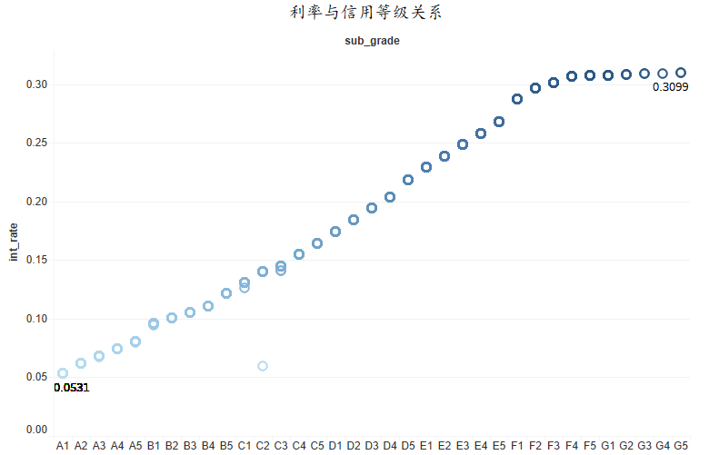

## Lending Club数据分析及报表设计

#### **一、数据特征**

**1**、首先整理数据集中的指标体系，理解每一个指标所代表的含义，具体如图1所示：

**2**、通过数据可视化（Tableau软件）观察数据特征：

根据提供的数据，首先观察数据中非正常缺失的情况，具体如表1所示，可见缺失值占总的样本个数中比例不大，因此在之后的相关性分析中考虑将有缺失的数据删除。

然后选取主要的指标进行分析，从贷款客户的基本情况、借款行为、信用情况以及多变量分析四个层面探讨数据特征：

**（1）贷款客户的基本情况：**

**I 收入：**为连续性变量，因此设置区间将其离散化，得到收入的直方图，如图2所示：

从图2中可以看到，在申请贷款的用户中，55人的收入为0，大部分人的收入在25000到74999之间，其中贷款用户的平均收入为3488.33，收入差距明显。

**II 住房产权和房贷账户分布情况：**

图3横坐标表示住房产权，纵坐标表示房贷账户数量，圆圈颜色深浅表示所对应的贷款人数数量。可见在申请贷款的用户中，大部分人为抵押贷款房，自住房仅占13.79%。可见在拥有房产的所有权客户群体中，大部分人将可以上市流通的房屋用来抵押贷款。

同时可以注意到租房客户中，房贷账户数量为0的群体占大多数，而房贷数量在10以上的大都集中在抵押贷款房全体中。

**（2）贷款客户的借款行为：**

**I 借款金额分布：**

图4描述了每个借款目的下平均贷款金额（折线图），条形图则对应不同借款目的下的放贷笔数，不同的颜色代表不同周期。

从图4中的柱形图可以得到，该贷款平台上用途最多的为债务重组（借新债还旧债），其次是信用卡还款，第三是住房改善。一般来说，贷款用途为债务重组和信用卡还款的客户现金流较为紧张，这部分客户的偿还贷款能力较弱，发生违约的可能性较高。同时可以看到不管在哪种借款目的中，客户都更偏向于36个月的贷款周期。

从每个借款目的下平均贷款金额来看，用于商业目的的贷款数量虽然不是很多，但是平均每笔贷款金额较大，所需要的资金会较多，而用于旅游消费的平均贷款金额最少。

**II 借款状态：**

其中Current和Fully Paid可归结为正常贷款，其余的为问题贷款，占1.89%，可见，该平台客户总体违约率较低，平台运营状况良好。

**（3）贷款客户的信用情况：**

**I 信用等级分布：**

首先将信用等级分为A，B，C，D，E，F，G五类，每一个信用等级下均再细分了5类（例如A等级下有A1，A2，A3，A4，A5），得到如图5所示的柱形图。

从图5中可以得到，该贷款平台客户信用等级大多集中在A，B，C三个等级中，占比为80.87%，说明该平台总体来说客户信用情况良好，且在每个等级体系下，分等级分布大致均匀。

**II 逾期情况：**

从图6和图7中可以得到，2年内30天以上逾期次数和历史总计120天及以上逾期账户数目为0的客户占大多数，且有预期行为的也大多集中在1次和2次，间接反映了该平台贷款客户信用状况良好。

从上述三个层面对数据进行分析和探索，可得到如下数据特征：

**4）多变量分析：**

**I 信用等级与借款状态的列联表分析：**

借款状态一共有5类，分别为注销、正在支付、付清、在观察期、以及逾期这5种状态，其中将正在支付和付清合并到一起为正常贷款用户，其余的为逾期贷款用户；信用等级中，将A和B合并，C和D合并，EFG合并，探究信用等级与付款状态是否有关联。

从上表中可以得到，卡方检验统计量为X2=148.273，且P值接近于0，在5%的水平显著，故拒绝独立的原假设，即认为借款状态与信用等级是有关联的。其中违约用户中性等级（C，D）下占据较大比例。 

**II 信用等级与各个变量的关系：**

- 信用等级与利率的关系：

首先观察需要分析的因变量借款利息（int_rate），一共有41种不同的利率水平，而在上面所列出的影响因素中，共有36种信用等级，因此猜测信用水平很可能会影响利率，且在大多数情况下，一个信用等级水平对应一种借款利率。

从上图中可以看到，颜色越深，表示利率越高。因此信用等级越高，所对应的借款利率越低，A1等级的借款利率为0.0531，G5等级的借款利率为0.3099；具体而言，信用等级A1到E5，基本为一条线性增长的曲线，E5到F1利率提升幅度较大，之后随着信用等级下降，利率提升幅度不大，基本为一条直线。

同时可以注意到，C1，C2和C3信用等级都对应两个较为明显的利率水平，因此将这几个信用等级数据单独做统计分析，结果如表5所示：

从表中可以得到，C1，C2等级中均只有一条记录有不同的利率水平，C3中有两条不同利率水平的记录，因此猜测是某种因素让借款人获得了相应的贷款优惠，例如借款人工作单位的特殊性等等；C2等级中两个利率水平相差较大，有可能为异常数据。

- 信用等级与征信情况的关系：

从图10中可以得到，信用等级越高，所对应的借款余额占总授信额度的比例中位数水平越低，而历史授信账户数目却没有显著差别；同时可以发现G信用等级水平下，借款余额占总授信额度的比例波动范围明显小于其他信用等级，历史授信账户中位数水平也要略高于其他等级水平。

- 信用等级与征信金额的方差分析：

从表6中可以得到，截距项即为A信用等级下平均征信金额，在5%的显著性水平下，B、C、D和F与A信用等级下平均征信金额有显著性差异，且B和C信用等级下的平均征信金额要小于A等级。

**III 借款状态与各个变量之间的关系：**

- 借款状态与借款金额的关系：

从图11中可以得到，逾期客户借款金额的中位数水平要明显高于正常客户，因此可以初步判断，借款金额越高的客户越有可能发生违约风险。

- 借款状态与借款余额占总授信额度的比例的关系：

   

从图12中可以得到，正常客户借款余额占总授信额度的比例中位数水平明显低于其他用户群体，因此，比例越低，发生违约的可能性就越小；在结合之前所分析的，借款余额占总授信额度的比例越低，所对应的信用等级水平越高，两次分析结果可以相互呼应。

**IV 相关性分析：**

收入，贷款收入比，月供金额和借贷金额，客户当前授信总额度以及客户当前借款余额占总授信额度的比例做相关性分析，考虑到各个指标的量纲不一致，故先对数据进行标准化，得到热力图13： 

从图13中可以得到，月供金额和贷款金额之间呈现高度的相关性，为0.954，这也符合实际的情况。其余的相关性偏弱，其中月收入和贷款收入比的相关系是为负，收入越高，贷款收入比越低。

综合以上分析，通过多变量分析得到的数据特征有以下几点：

#### **二、数据监控报表**

数据监控报表设计的具体思路：

模块划分：

这里只是简单地说一下报表设计的思路，从预警的角度出发，即根据预期客户和正在还款的客户数据，刻画两类用户的用户画像，并进行比较；而后台则可根据算法，选出重要的特征工程，根据监督学习方法构建个人信用风险模型，并预测正在哪些还款的用户中有可能发生预期行为。 